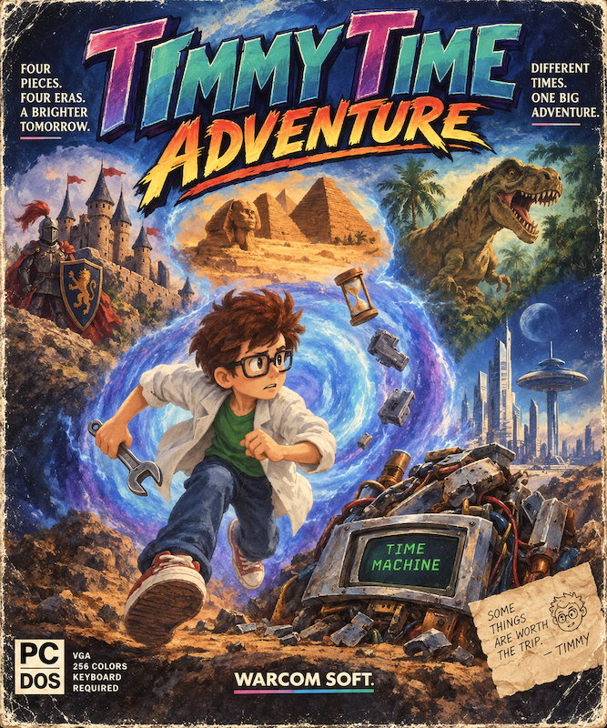

<p align="center">
  
</p>

# Timmy Time Adventure

A retro platformer for MS-DOS, with the gameplay of 8-bit console games and the graphics of 16-bit ones.

Timmy is a little inventor, and his latest project is a time machine. When he switches it on, it blows up, and Timmy and its pieces are scattered across history. Get him through four eras (the Jurassic, ancient Egypt, the Middle Ages and the Wild West), past enemies and traps, to recover the four missing pieces and get back home.


## Playing

| Key | Action |
| --- | --- |
| Arrows | Move, climb, crouch |
| `Z` | Jump (hold for a higher jump) |
| `X` | Pick up and throw objects, punch while jumping |
| `Down` + `X` | Short throw |
| `Enter` | Confirm |
| `Esc` | Menu |
| `Space` | Pause |

Keys can be remapped from the options menu. The game is available in English, Spanish, Valencian, Galician, Basque, Catalan and Portuguese.

### Requirements

- MS-DOS or compatible (or DOSBox-X)
- A DPMI host such as [CWSDPMI](http://sandmann.dotster.com/cwsdpmi/) (included)
- 486DX2 66MHz or better, VGA
- 8MB of RAM
- Sound Blaster (optional)

## Building

You'll need:

- GNU Make
- [DJGPP](https://github.com/andrewwutw/build-djgpp/releases) cross-compiler
- Allegro 4.2.3.1 (the last version with DOS support)
- Python 3.10.11 or newer, to convert the Tiled maps to binary files
- DOSBox-X, to run it

Set `OS_INC_DIR`, `OS_GCC`, `OS_LIB_DIR` and `OS_DOSBOX` in the `Makefile` to your own paths, then:

```sh
make release
```

and run `TIMMY.EXE` in DOSBox-X. If you use the VS Code C/C++ extension, point `.vscode/c_cpp_properties.json` at your compiler and libraries too.

Resource `.dat` files are built with Jordi's [Allegro dat replacement](https://github.com/jsmolina/allegro-dat-replacement). Art was made with Aseprite, maps with Tiled, and music with Reaper.

### Adding a language

1. Copy `res/game/eng.txt` to a new file in `res/game/` and translate it line by line (keep the order, and `|` for line breaks).
2. Add the language to `E_TEXT_LANGUAGES` and its name to `LANG_TXT_OPTIONS` in `src/game.h`.
3. Load it in `game_init()` in `src/game.c`.
4. Rebuild; `src/data/gdata.h` is regenerated with the new text's index.

## Credits

Made by Warrior (Warcom Soft.). Licensed under the GPLv3.
